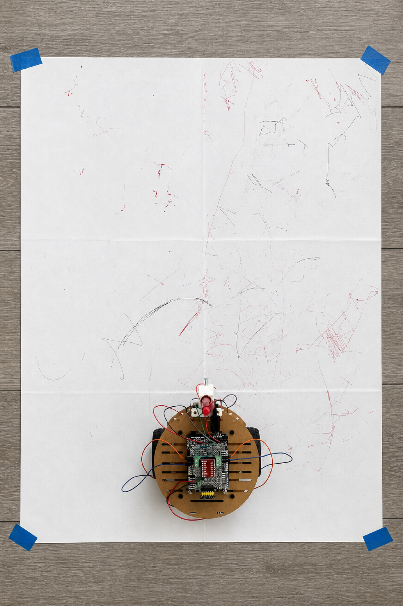
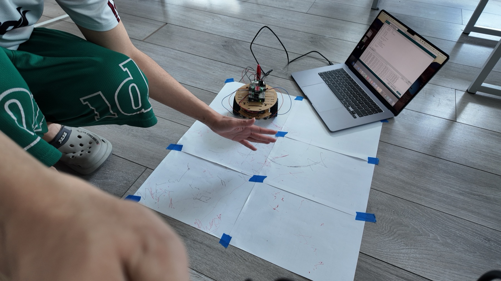
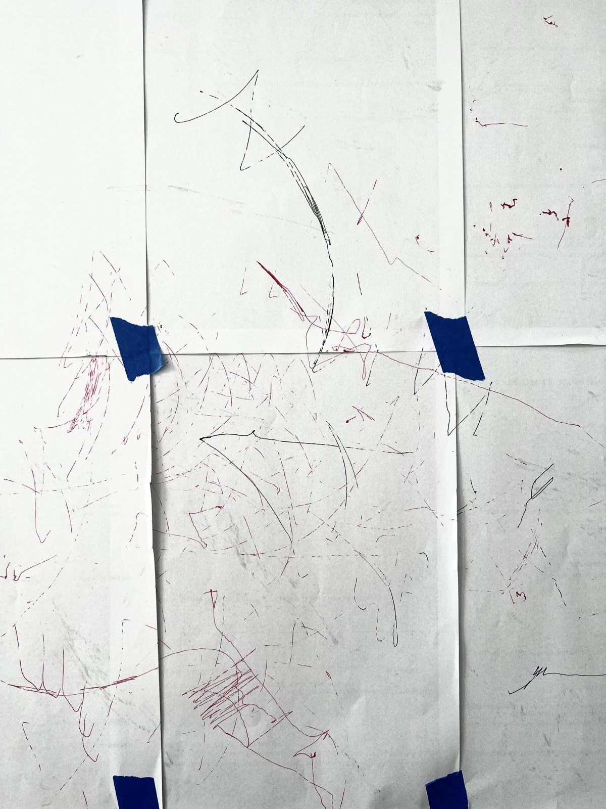
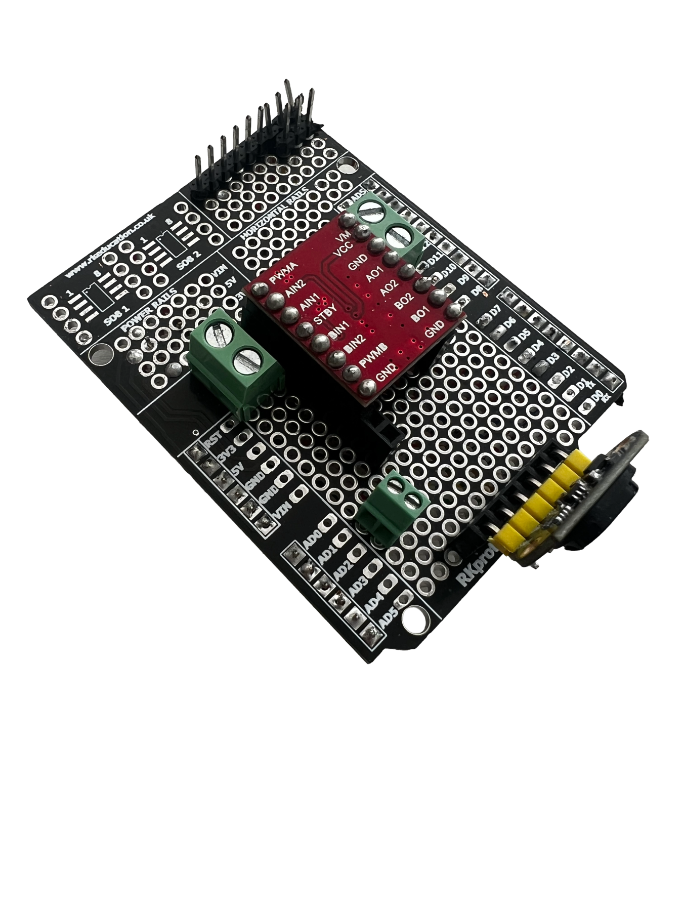
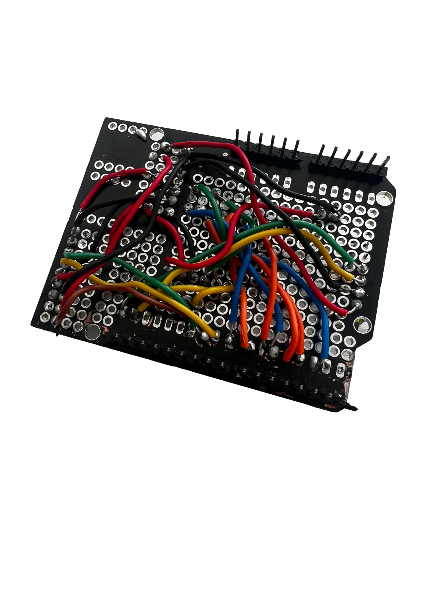
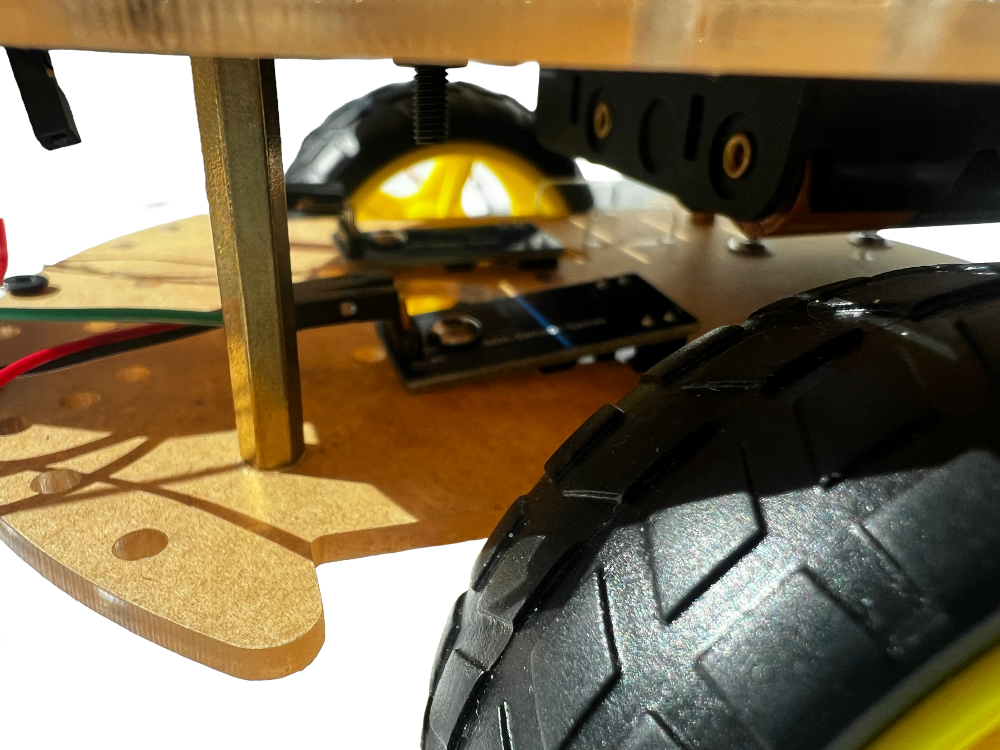
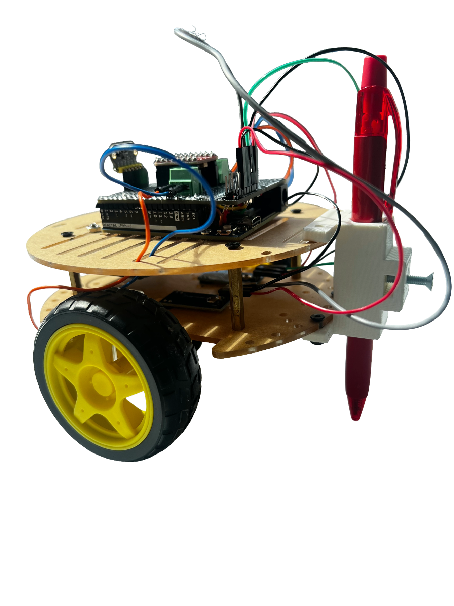
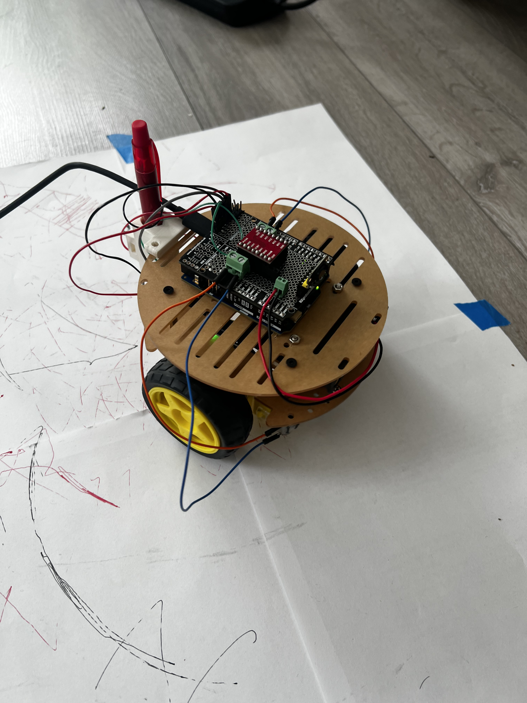

# Stitch

**A distance-responsive drawing robot**

[English](README.md) | [中文](README.zh-CN.md)



Stitch is a drawing robot that changes its movement based on distance. A front ToF sensor detects how close a person or object is, and the robot switches between approaching, pausing, moving side to side, and backing away. A rear pen records these actions as visible traces on paper.

## Project overview

- **My work:** concept development, hardware assembly, soldering, Arduino programming, testing, and documentation
- **Controller:** Arduino Uno R4 WiFi
- **Sensing:** VL53L1X / TOF400C distance sensor and two LM393 wheel encoders
- **Motion:** two DC geared motors controlled through a TB6612FNG driver
- **Output:** a fixed rear pen that records the robot's movement



## How it works


The ToF sensor reads the space in front of the robot. The Arduino smooths the distance value, selects a behaviour, and sends a matching command to the two motors. The wheel encoders count pulses for monitoring, while the rear pen leaves a trace of every response.

## Behaviour map

| Distance | State | Movement |
| --- | --- | --- |
| More than 700 mm | `APPROACH` | Move forward |
| 550 to 700 mm | `HESITATE` | Pause, then move forward slowly |
| 200 to 550 mm | `NEGOTIATE` | Move from side to side |
| Less than 200 mm | `REFUSE` | Reverse, then stop |

These thresholds come directly from the final Arduino controller.



## Hardware

| Part | Purpose |
| --- | --- |
| Arduino Uno R4 WiFi | Main controller |
| VL53L1X / TOF400C | Front distance sensing over I2C |
| TB6612FNG | Dual DC motor control |
| Two DC geared motors | Movement |
| Two LM393 encoder modules | Wheel pulse monitoring |
| 4AA battery pack | Separate motor supply |
| Fixed rear pen holder | Records the movement on paper |

The detailed wiring is documented in [the pin map](hardware/pin-map.md). The components are listed in [the bill of materials](hardware/bill-of-materials.md).

## Build and iteration

The control circuit was soldered onto a prototyping shield to make the wiring more stable. Modular connections made the motors, ToF sensor, and encoders easier to test separately.

The two motors did not move at exactly the same speed. The final controller adds a PWM offset of 35 to the right motor. Encoder pulses are printed to the serial monitor to show the difference between the two wheels; they are used for monitoring rather than closed-loop speed control.

The project also tested a servo pen-lift mechanism. The final prototype uses a fixed rear pen because it is simpler and keeps the focus on the robot's movement.

<p>
  
  
</p>

<p>
  
  
</p>

## Testing

Testing was completed in three stages:

1. **Mechanical check:** an unpowered push test checked pen pressure and possible interference between the pen, wheels, cables, and encoder disks.
2. **Motor and encoder check:** low-speed tests confirmed wheel movement and exposed differences between the two motors.
3. **Distance behaviour check:** a hand, card, or body position changed the ToF reading and triggered transitions between the four behaviours.

The tests showed that changes in distance produced visibly different traces, including continuous lines, pauses, turns, overlapping marks, and backward strokes.



## Code

### Main controller

- [`tof_motor_behavior_test.ino`](firmware/tof_motor_behavior_test/tof_motor_behavior_test.ino) combines ToF sensing, distance filtering, four behaviours, motor control, encoder monitoring, PWM compensation, and serial commands.

### Diagnostic sketches

- [`i2c_scanner.ino`](firmware/diagnostics/i2c_scanner/i2c_scanner.ino) checks whether the ToF sensor appears on the I2C bus.
- [`dual_encoder_test.ino`](firmware/diagnostics/dual_encoder_test/dual_encoder_test.ino) reads both wheel encoders.
- [`serial_motor_control.ino`](firmware/diagnostics/serial_motor_control/serial_motor_control.ino) tests motor direction and speed from the serial monitor.

## Running the main controller

1. Install the **VL53L1X by Pololu** library in Arduino IDE.
2. Open `firmware/tof_motor_behavior_test/tof_motor_behavior_test.ino`.
3. Select **Arduino Uno R4 WiFi** and the correct serial port.
4. Upload the sketch.
5. Open the serial monitor at **9600 baud**.

Serial commands:

| Command | Action |
| --- | --- |
| `s` | Stop and pause the behaviour system |
| `g` | Resume the behaviour system |
| `c` | Clear the encoder pulse counts |
| `1` to `9` | Change the movement speed |

## Current limitations

- The ToF sensor mainly reads the area directly in front of the robot.
- Pen pressure and paper friction affect the drawing quality.
- The two motors still have different physical characteristics.
- The current encoder readings are used for monitoring, not automatic speed correction.

## Repository structure

```text
stitch-drawing-robot/
├── README.md
├── README.zh-CN.md
├── assets/
├── docs/
│   └── development-and-testing.md
├── firmware/
│   ├── diagnostics/
│   └── tof_motor_behavior_test/
└── hardware/
    ├── bill-of-materials.md
    └── pin-map.md
```

## Project status

Working course prototype. The repository contains the final integrated Arduino controller and selected diagnostic sketches used during development.
