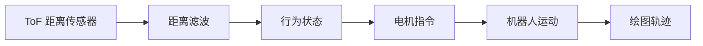

# Stitch

**根据距离改变动作的绘图机器人**

[English](README.md) | [中文](README.zh-CN.md)


Stitch 是一台会根据距离改变动作的绘图机器人。前置 ToF 传感器判断人或物体离它有多近，机器人随后在接近、停顿、左右摆动和后退之间切换。车尾的画笔会把这些动作留在纸上，让互动过程变成一张看得见的轨迹。

## 项目概况

- **我的工作：**概念设计、硬件组装、焊接、Arduino 编程、测试与项目记录
- **主控制器：**Arduino Uno R4 WiFi
- **传感器：**VL53L1X / TOF400C 距离传感器和两个 LM393 轮速编码器
- **运动系统：**两台由 TB6612FNG 驱动的直流减速电机
- **输出方式：**固定在车尾的画笔记录机器人运动轨迹


## 工作方式



ToF 传感器读取机器人前方的距离。Arduino 对距离数据进行平滑处理，选择对应行为，并向两台电机发送运动指令。车轮编码器记录脉冲用于监测，车尾画笔则把每次响应转化为纸面轨迹。

## 行为区间

| 距离 | 状态 | 动作 |
| --- | --- | --- |
| 大于 700 mm | `APPROACH` | 向前移动 |
| 550–700 mm | `HESITATE` | 暂停后缓慢向前 |
| 200–550 mm | `NEGOTIATE` | 左右摆动 |
| 小于 200 mm | `REFUSE` | 后退后停止 |

以上距离阈值直接来自最终 Arduino 主程序。


## 硬件组成

| 部件 | 用途 |
| --- | --- |
| Arduino Uno R4 WiFi | 主控制器 |
| VL53L1X / TOF400C | 通过 I2C 读取前方距离 |
| TB6612FNG | 控制两台直流电机 |
| 两台直流减速电机 | 驱动机器人运动 |
| 两个 LM393 编码器模块 | 监测车轮脉冲 |
| 4 节 AA 电池盒 | 为电机独立供电 |
| 固定式车尾画笔架 | 在纸面记录运动轨迹 |

详细接线信息见[引脚说明](hardware/pin-map.md)，组件列表见[物料清单](hardware/bill-of-materials.md)。

## 搭建与迭代

控制电路被焊接在原型扩展板上，以提高接线稳定性。模块化连接方式使电机、ToF 传感器和编码器可以分别进行测试。

由于两台电机的实际速度并不完全相同，最终控制程序对右侧电机增加了 35 的 PWM 补偿。编码器脉冲会输出到串口监视器，用于观察左右车轮差异；它们只用于监测，并未构成闭环速度控制。

项目还测试过舵机抬笔机构。最终原型采用固定式车尾画笔，因为结构更简单，也能让展示重点保持在机器人的运动本身。

<p>
  
  
</p>

<p>
  
  
</p>

## 测试

测试分为三个阶段：

1. **机械检查：**在不通电的情况下推动机器人，检查画笔压力，以及画笔、车轮、线缆和编码器码盘之间是否存在干涉。
2. **电机与编码器检查：**通过低速测试确认车轮运动，并观察两台电机之间的差异。
3. **距离行为检查：**使用手、卡片或身体位置改变 ToF 读数，验证四种行为之间的切换。

测试表明，不同距离能够产生明显不同的轨迹，包括连续线条、停顿、转向、重叠痕迹和后退笔画。


## 代码

### 主控制程序

- [`tof_motor_behavior_test.ino`](firmware/tof_motor_behavior_test/tof_motor_behavior_test.ino) 集成 ToF 距离读取、距离滤波、四种行为、电机控制、编码器监测、PWM 补偿和串口命令。

### 诊断程序

- [`i2c_scanner.ino`](firmware/diagnostics/i2c_scanner/i2c_scanner.ino) 用于检查 ToF 传感器是否出现在 I2C 总线上。
- [`dual_encoder_test.ino`](firmware/diagnostics/dual_encoder_test/dual_encoder_test.ino) 用于读取左右车轮编码器。
- [`serial_motor_control.ino`](firmware/diagnostics/serial_motor_control/serial_motor_control.ino) 用于通过串口监视器测试电机方向和速度。

## 运行主控制程序

1. 在 Arduino IDE 中安装 **VL53L1X by Pololu** 库。
2. 打开 `firmware/tof_motor_behavior_test/tof_motor_behavior_test.ino`。
3. 选择 **Arduino Uno R4 WiFi** 和正确的串口。
4. 上传程序。
5. 以 **9600 波特率**打开串口监视器。

串口命令：

| 命令 | 功能 |
| --- | --- |
| `s` | 停止并暂停行为系统 |
| `g` | 恢复行为系统 |
| `c` | 清空编码器脉冲计数 |
| `1`–`9` | 调整运动速度 |

## 当前限制

- ToF 传感器主要读取机器人正前方的区域。
- 画笔压力和纸面摩擦会影响绘图质量。
- 两台电机仍然具有不同的物理特性。
- 当前编码器数据仅用于监测，不会自动修正电机速度。

## 仓库结构

```text
stitch-drawing-robot/
├── README.md
├── README.zh-CN.md
├── assets/
├── docs/
│   └── development-and-testing.md
├── firmware/
│   ├── diagnostics/
│   └── tof_motor_behavior_test/
└── hardware/
    ├── bill-of-materials.md
    └── pin-map.md
```

## 项目状态

这是一个可以运行的课程原型。仓库包含最终整合的 Arduino 主控制程序，以及开发过程中使用的部分诊断程序。
